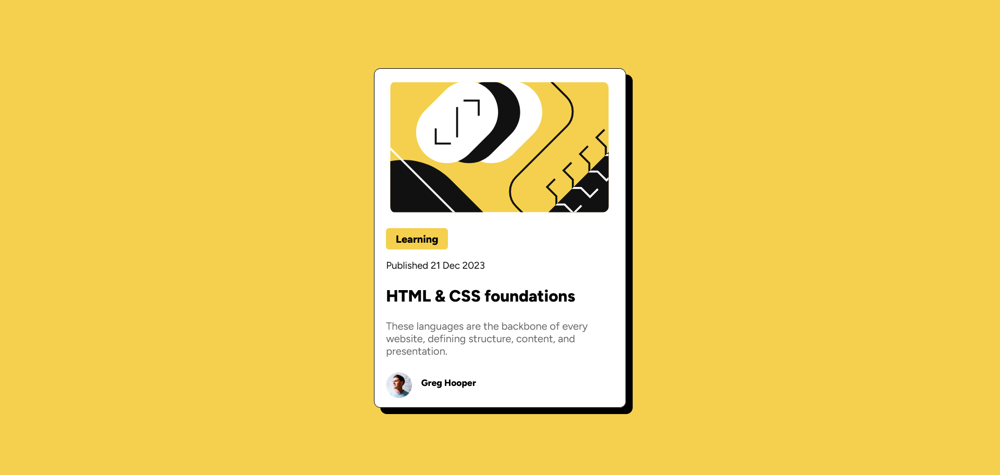

# Frontend Mentor - Blog Preview Card

This is my solution to the [Blog preview card challenge on Frontend Mentor](https://www.frontendmentor.io/challenges/blog-preview-card-5KqSdt2Z9). It's a simple responsive card design that helped me practice layout and styling fundamentals.

## 📸 Screenshot

## 🛠️ Built With

- HTML5
- CSS3
- Flexbox
- Mobile-first workflow

## 🚀 What I Learned

In this project, I practiced:

- Building clean and responsive components
- Using Flexbox to align content
- Applying consistent styling and spacing
- Structuring semantic HTML

## 👩‍💻 Author

- GitHub: [YASMEENELSHAMY](https://github.com/YASMEENELSHAMY)

## 🙏 Acknowledgments

Thanks to [Frontend Mentor](https://www.frontendmentor.io/) for the challenge and resources!
